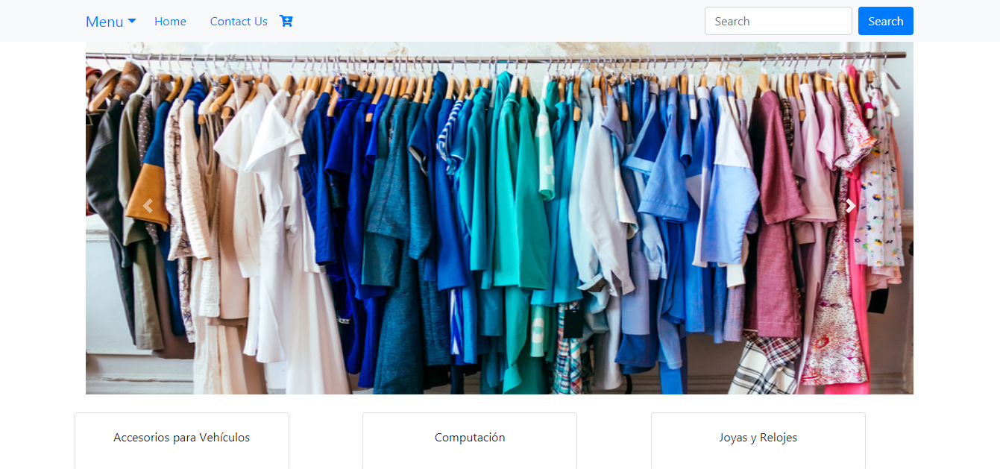
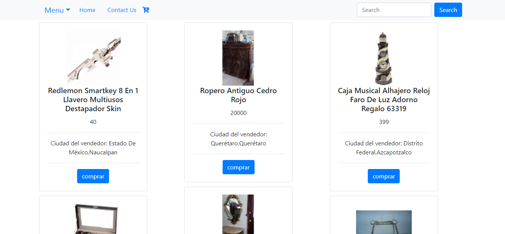

## GET IT 

E-commerce pensado en las personas que no tienen tiempo para ir a buscar cosas que desean comprar en tiendas físicas por ello Get It mezcla la practicidad de encontrar todos los artículos que puedas imaginar en una sola página para que estes a un solo click de comprar eso que tanto haz deseado. 

En un Inicio puedes encontrar las diferentes categorias en las cuales puedes navegar o simplemente en el campo de busqueda escribir que estas buscando y te mostraremos las opciones que necesitas para elegir el indicado para ti.

### VISUALIZACIÓN DESKTOP

### RETO

Como reto final de este curso deberás crear una app web bajo los principios de SPA (Single page aplication)

Para ello debes entender y aplicar los siguientes conceptos.

Templating Routing (URLs) DOM & Event Handling (State) Patrón de arquitectura de software (MV*)

### TECNOLOGÍAS APLICADAS

- HTML5
- CSS3
- Jquery
- APIs Mercadolibre / PayPal
- Bootstrap

### ELABORADO PARA LABORATORIA

### ELABORADO POR:
Francia Vázquez Ornelas

